#  Node.js Application Deployment using Jenkins Pipeline

This project demonstrates **CI/CD automation** using Jenkins Pipeline to deploy a Node.js application automatically to an AWS EC2 instance.

The pipeline performs repository cloning, file transfer, dependency installation, and application deployment using SSH.

## Architecture
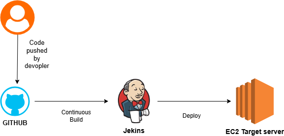

## Jenkins Pipeline Stages

### Step 1: Clone the  Repository

- Pulls latest code from GitHub main branch.

    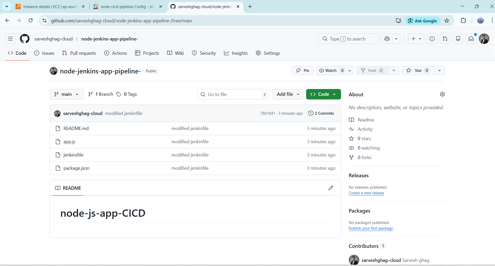

### Step 2 : Launch AWS EC2 Server
- Go to AWS Console

- Launch two Instance 
    1. jenkins
    2. target server

- Select Ubuntu

- Allow Security Group Ports:

| Port | Purpose      |
| ---- | ------------ |
| 22   | SSH          |
| 3000 | Node App     |
| 80   | Optional Web
| 8080 | jenkins      |

### Step 3 : Install Required Software on Target EC2 server
```
sudo apt update
sudo apt install nodejs npm -y
sudo npm install -g pm2
```
  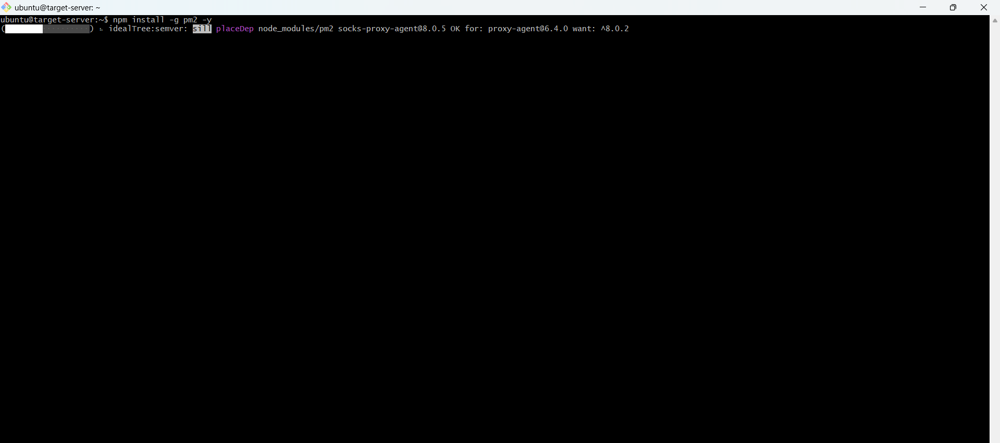
  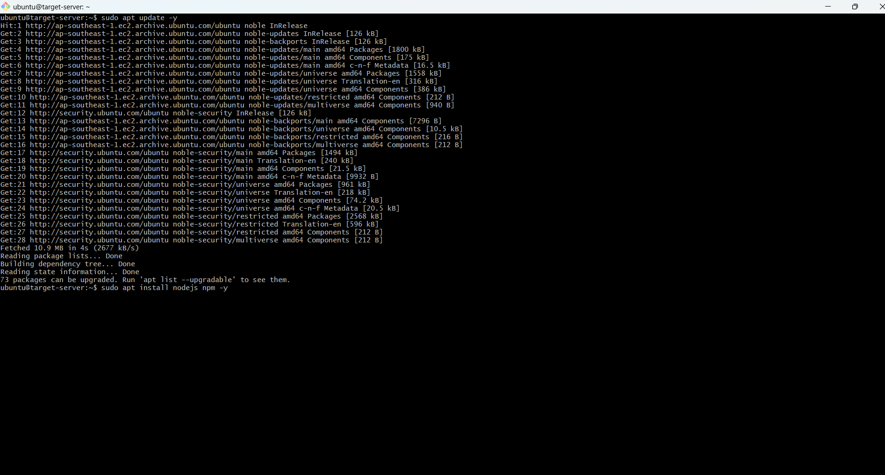

### Step 5 — Open Jenkins Server
- Install Jenkins Plugins
- Manage Jenkins → Plugins
- Install 
    1. Git 
    2. Pipeline 
    3. SSH Agent 
    4. Github Integration 

  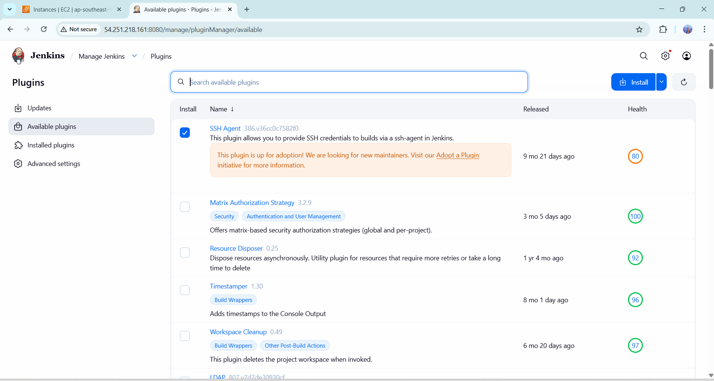

### Step 6: Add SSH Credentials
1. Manage Jenkins → Credentials

2. Add Credentials 

- Choose:

- Kind → SSH Username with private key

- Username → ubuntu

- Private Key → paste .pem file

- ID → node-app-key

    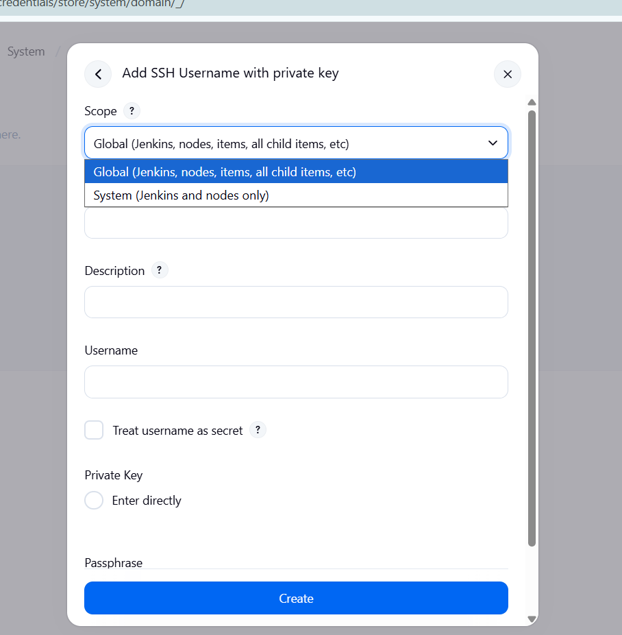
    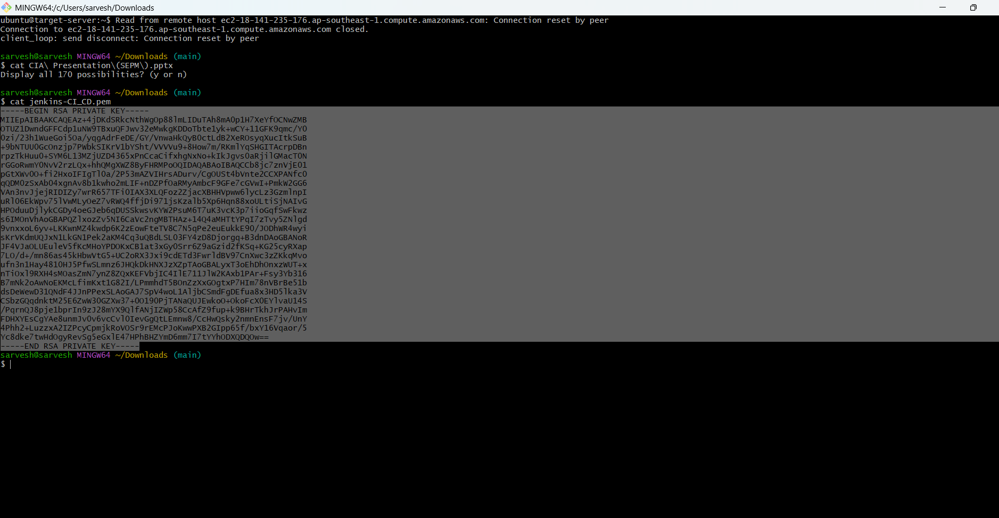
    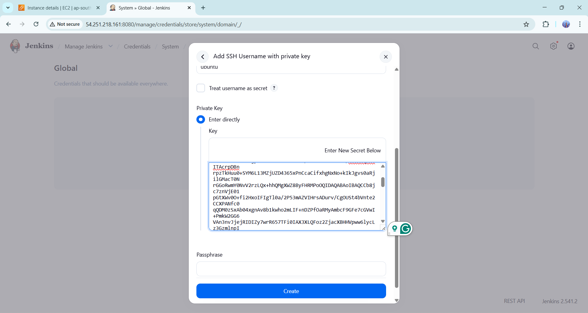

### Step 7 : Create Jenkins Pipeline Job

- New Item

- Name → node-cicd

- Select → Pipeline

- Pipeline Script from SCM

- SCM → Git

- Repository URL → your GitHub repo

- Branch → main

- Script Path → Jenkinsfile
  
  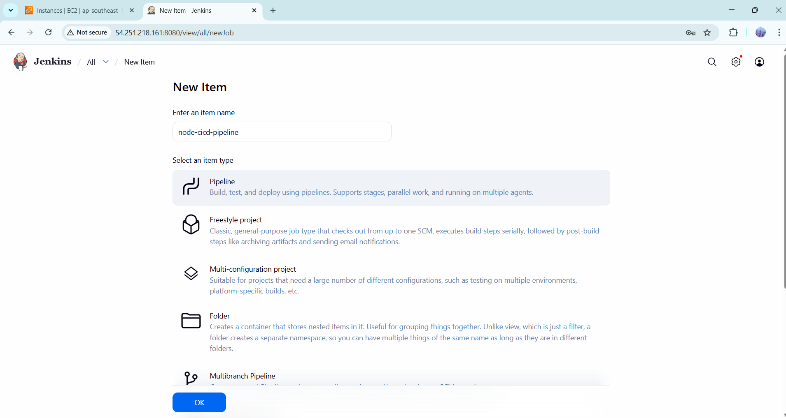
  

### Step 8 — Add Jenkinsfile (CI/CD Logic)
- Create Jenkinsfile in repo:
```
pipeline {
    agent any

    environment {
        SERVER_IP='EC2-IP'
        REMOTE_USER='ubuntu'
        REMOTE_PATH='/home/ubuntu/node-app'
        SSH_CREDENTIAL='node-app-key'
    }

    stages {

        stage('Clone') {
            steps {
                checkout scm
            }
        }

        stage('Deploy to EC2') {
            steps {
                sshagent([SSH_CREDENTIAL]) {
                    sh """
                    ssh -o StrictHostKeyChecking=no ${REMOTE_USER}@${SERVER_IP} 'mkdir -p ${REMOTE_PATH}'
                    scp -r * ${REMOTE_USER}@${SERVER_IP}:${REMOTE_PATH}
                    """
                }
            }
        }

        stage('Run App') {
            steps {
                sshagent([SSH_CREDENTIAL]) {
                    sh """
                    ssh ${REMOTE_USER}@${SERVER_IP} '
                        cd ${REMOTE_PATH}
                        npm install
                        pm2 start app.js --name node-app || pm2 restart node-app
                    '
                    """
                }
            }
        }
    }
}
```
### Step 9 : Run Pipeline

- In Jenkins:
    
    - Click Build Now

    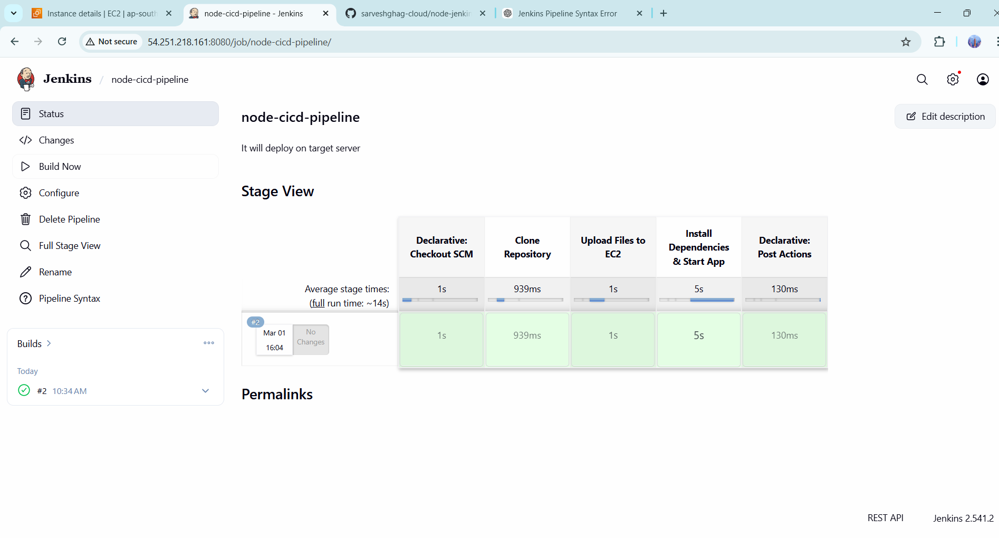

- Verify Deployment
- Open browser:

    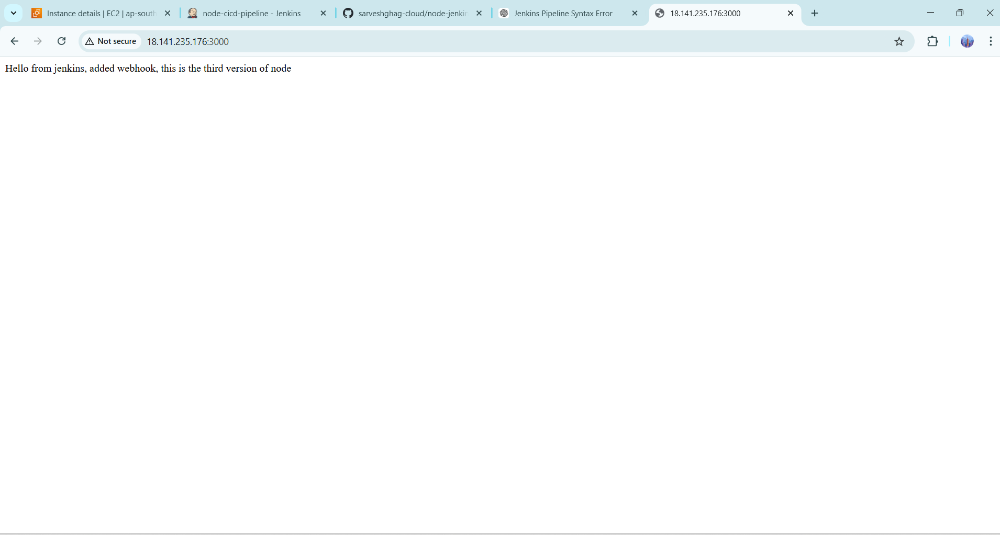

### Step 10: Enable AUTO CI/CD

- GitHub → Settings → Webhooks
- Add:
```
http://JENKINS-IP:8080/github-webhook/
```
    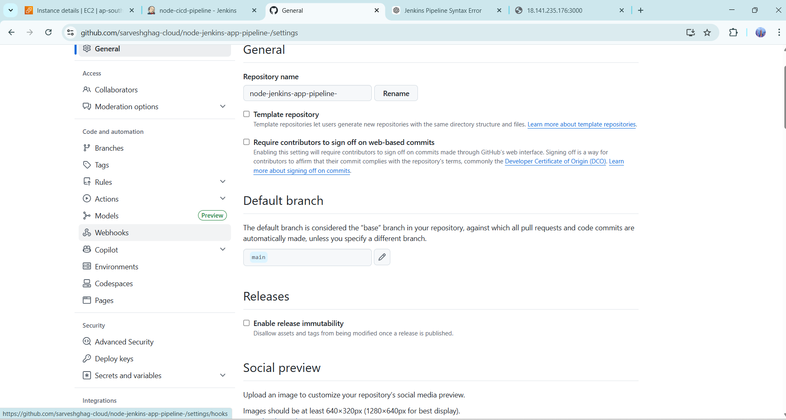
    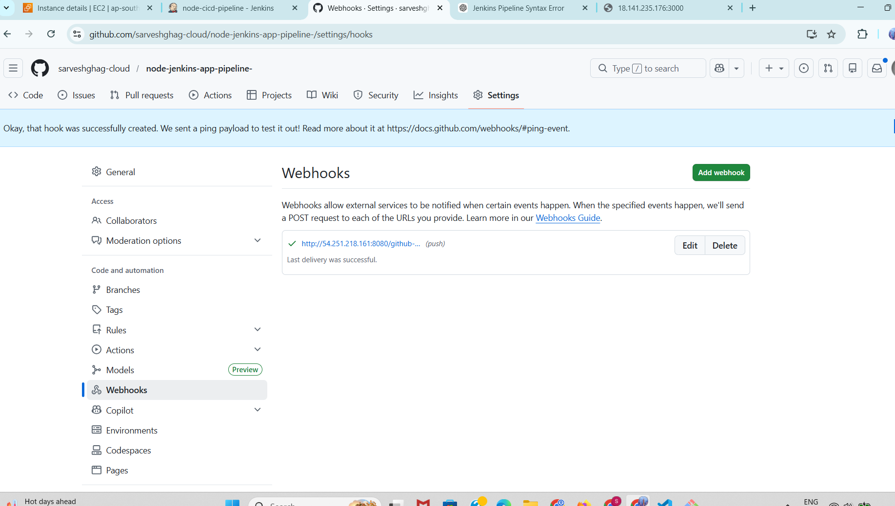

- go to jenkins server 
    - enable the github hook trigger
    
    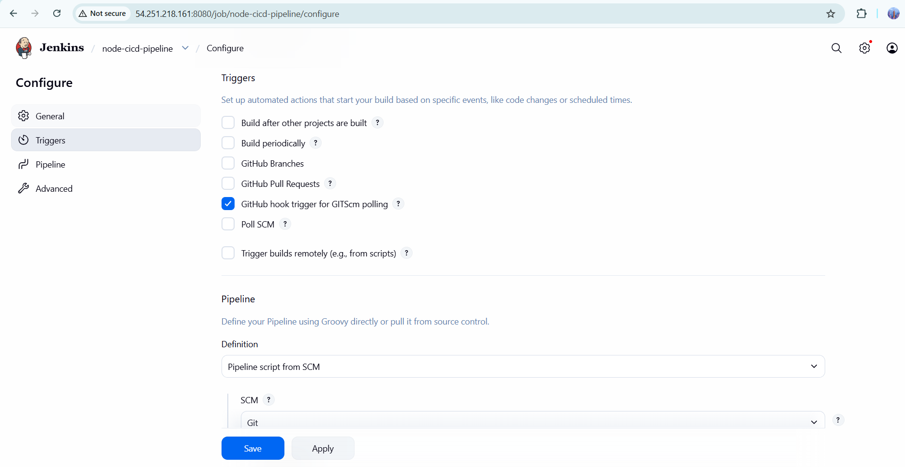

### Step 11: verify the AUTO CI/CD 
- push the node project to github 
- now Updated Automatically on server

  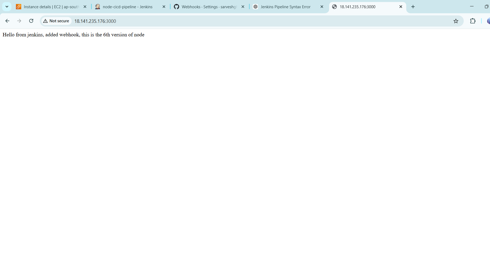 

